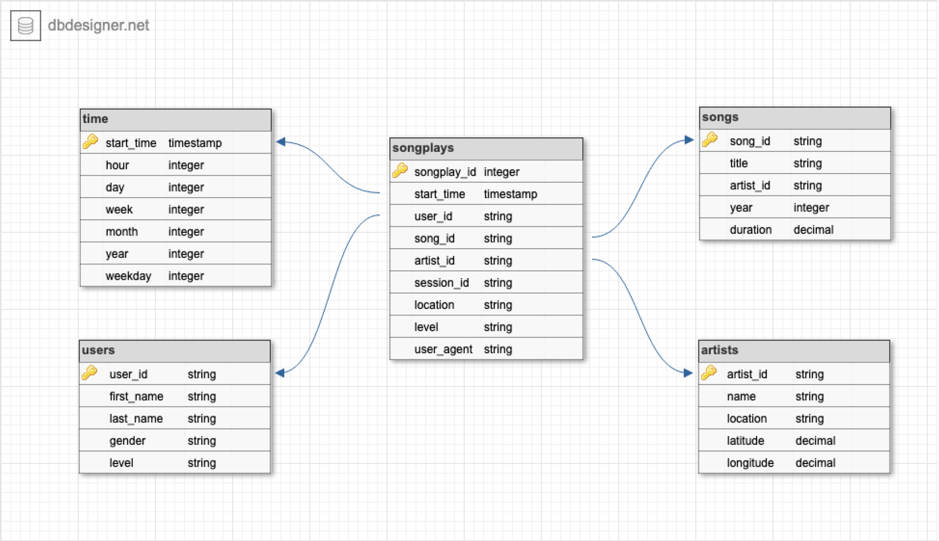

## Data Lake and ETL pipeline with Spark

### Introduction
Sparkify, a music streaming startup, has been collecting on songs and user activities on their new music streaming app. I am particularly interested in understanding what songs users are listening to. Since the data resides in a directory of JSON logs on user activity on the app, as well as a directory with JSON metadata on the songs in their app, there isn't an easy way to query the data.

In this project, I defined fact and dimension tables for a star schema for a particular analytic focus. And then, I build a data lake and an ETL pipeline in Spark that loads data from S3, processes the data into analytics tables, and loads them back to S3. At end, I tested the data lake and ETL pipeline by running queries and analyzing the performance.

### Schema Design

##### *Schema*

##### *Fact Table*
1. songplays - records in log data associated with song plays i.e. records with page NextSong
  - songplay_id, start_time, user_id, level, song_id, artist_id, session_id, location, user_agent

##### *Dimension Tables*
2. users - users in the app
  - user_id, first_name, last_name, gender, level
3. songs - songs in music database
  - song_id, title, artist_id, year, duration
4. artists - artists in music database
  - artist_id, name, location, latitude, longitude
5. time - timestamps of records in songplays broken down into specific units
  - start_time, hour, day, week, month, year, weekday

### About the Scripts
- **etl.py**: build a data lake and an ETL pipeline in Spark that loads data from S3, processes the data into analytics tables, and loads them back to S3.
- **testing.ipynb**: displays the first few rows of each table to check the data lake.
- **dwh.cfg**: DWH Params
- **Data_Lake_ETL.ipynb**: similar code with etl.py.

**To run the script:**
`python etl.py`
